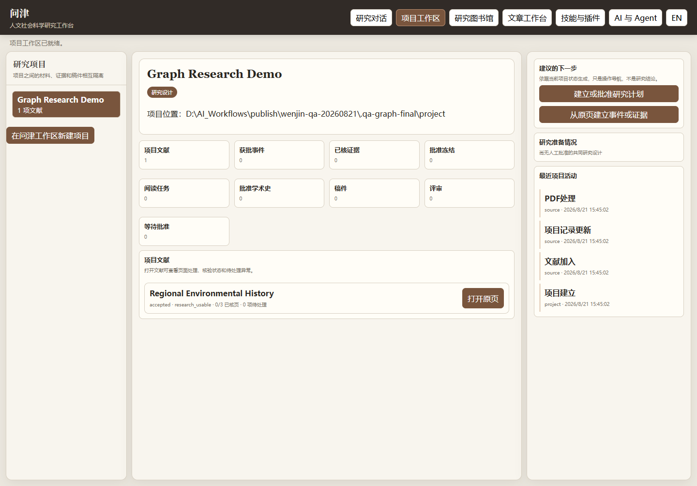
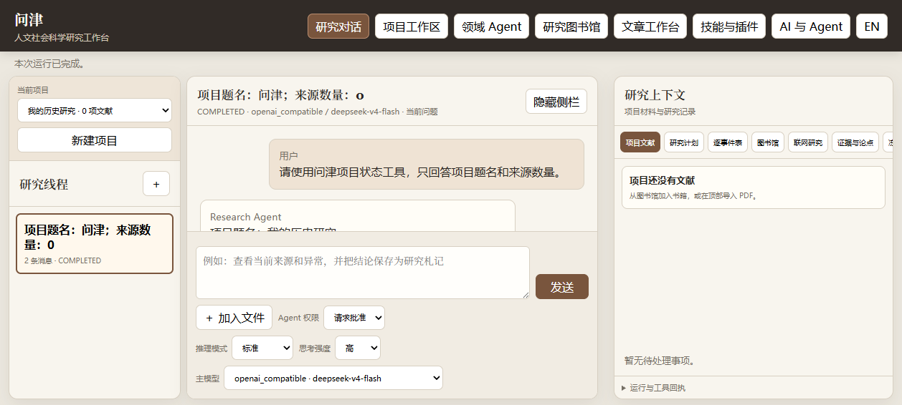
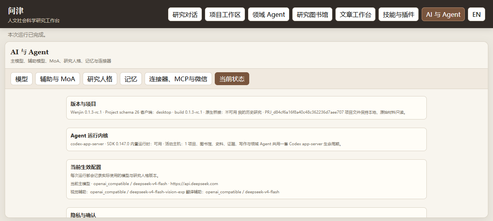
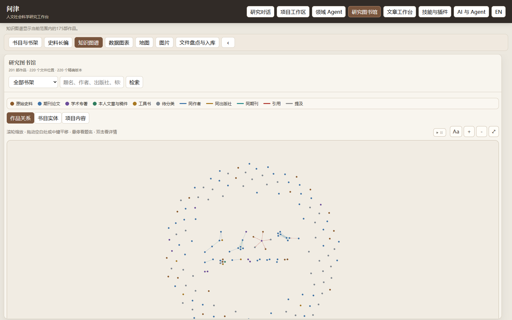

# 问津｜人文社会科学研究工作台

[English](README_EN.md) | 中文

问津是一个本地优先、模型可选、面向人文社会科学研究过程的 Agent 工作台。每项研究先落在一个独立的本地项目工作区，再把研究对话、个人图书馆、原页清洗、联网检索、证据固定、学术史、写作、Word 往返、Skills、CLI 与 MCP 组织在同一套可审计的项目数据上。

当前正式版本为 **0.1.3**，主要支持 Windows 10/11。







## 主要能力

- 独立项目工作区，可在指定的本地文件夹新建项目、登记已有项目，并查看研究阶段、材料、证据、稿件、待决定事项和最近活动；
- 包含数据库与项目材料副本的自动备份和非覆盖恢复，外置项目也纳入备份；
- 研究图书馆的作品、版本、文件与精确文件版本分层；
- 只读目录盘点、建议分类、人工确认后批量入库；
- PDF 原页、文本块、跨页关系和人工修复；
- 可回到来源版本与页码的证据、史料长编，以及可切换作品关系、书目实体与Markdown项目内容的知识图谱；
- 主模型、辅助模型、Ollama、OpenAI 兼容接口与可选 MoA；
- 内置 Codex app-server 单一 Agent 循环、版本化研究人格、Skills、MCP 与正式 CLI；
- 随安装包内置16项`Historical Research Skill Pack 0.3.0`与最新证据保真中文史学语言返修Skill；
- 结构化文章工作台、脚注/参考文献、DOCX 导入导出和多角色评审；
- 中英文核心导航、模型设置和文章模板；史学长期记忆与工程长期记忆分层接入；
- 标准领域插件工程与本地 ZIP/目录安装入口。
- Codex插件兼容导入：直接登记Skill，并把单一标准MCP服务适配为默认敏感的问津工具；不复制账号与专有bundled runtime。
- 实验性普通微信扫码私聊，可从微信继续本机问津中的研究对话。

## 安装

普通用户可从发布页下载 Windows 安装程序。安装包包含冻结的问津 Python 核心、Codex app-server 与桌面运行时；运行问津和自包含领域 Agent 不需要另装 Python、Node.js、PowerShell 7、Rust 或 Codex。只有明确运行包外脚本时才需要可选脚本环境，主 Agent 会先自检，并在用户批准后按需安装。Windows 10/11通常已有WebView2；断网机器可下载包含WebView2安装程序的完整离线包。

首次启动若没有真实主模型，问津会先引导连接本机Ollama或OpenAI兼容接口。Mock只用于自动化测试，不出现在正式客户端，也不会在配置失败时自动接管对话。每个新项目会自动建立一个空白研究线程；图书馆、项目整理和人工复核可以在暂不配置模型时继续使用。

当前安装包尚未代码签名，也没有自动更新服务；Windows可能显示未知发布者提示。请只从项目发布页下载。

## 图书馆盘点与入库

盘点与入库是两个动作：

1. 指定一个明确目录后，问津只读检查文件，生成题名、责任者、年代、材料类型、重复版本和建议书架；
2. 研究者可以批准当前页所选材料，也可以选择“按建议分类并批量入库”；
3. 入库只登记原路径、书目和精确文件版本，不移动、不改名、不修改原文件；
4. 自动分类属于整理建议，随时可以在书目详情中人工调整书架；
5. 入库不等于材料已经读完、可引用或成为正式证据。

当前书架包括原始史料、学术论文、学术专著、个人论文与稿件、读书笔记、工具书与目录、待分类。读书笔记默认不进入知识图谱；只有用户明确要求时，Agent/API才在当前查询中临时纳入。书目实体与项目内容在同一画布中切换，不混入默认作品图。



## Agent权限

每个研究线程可以选择：

- **请求批准**：每个会改变电脑状态的动作逐项暂停；
- **帮我批准**：权限代理自动批准常规键鼠、窗口和可逆整理，程序启动与命令执行等敏感动作仍询问；
- **完全访问**：本次运行可以自动调用 Computer Use、文件、程序、命令和已安装领域包暴露的工具，并保存完整审计记录。

从当前线程建立的新线程会继承有界父对话和项目状态。对话框可以直接加入文档、表格与图片；附件经实际检查后才算已读，不会因上传自动成为正式来源或冻结证据。允许隐式调用的研究Skills可由主Agent按自然语言请求自行选择并读取版本。

Computer Use 通过标准 MCP 领域包提供 Windows 控件树、截图、键盘、鼠标、程序启动和显式命令工具；浏览器后端另由 `agent-browser` 提供。密码控件、隐藏凭据提取、验证码求解和付款确认在三种模式下均不开放。

## 领域包

问津核心程序不绑定具体研究对象。领域包可以成为具有独立app-server线程和隔离记忆的领域 Agent，并增加专门研究Skill、受权限约束的工具和本地数据连接；MCP保留为自运行领域包与外部客户端的兼容边界。领域 Agent 可分别声明领域推理、主视觉、二次视觉复核和备用模型岗位，由问津凭据库在运行时注入，不要求用户编辑领域包。

领域包可以从GitHub Release、机构网站或其他分发位置取得。下载完成后，在“领域 Agent”工作区选择本地ZIP或解压目录安装；若需要本地数据库，安装后再选择用户已有的SQLite、CSV或目录。问津只登记所选数据，不复制或改写数据库。

仓库提供领域包编排教程和工程框架，不预装任何具体学科样例或用户数据。编排从研究问题、材料与许可证、工具及权限、功能进入问津的位置、运行时和验收五部分开始；只有这些边界明确后才生成工程骨架。大型数据与独立工具包应在领域项目自己的Release或其他分发位置提供。

普通用户不需要单独安装Python：问津核心的数据和SQLite操作运行在安装包内的冻结侧车中。领域包若需要Python、表格处理库或专用数据库驱动，应像普通桌面程序一样提供自运行MCP可执行文件；不要依赖用户电脑上的开发环境。源码开发者仍需Python 3.13。

建立新插件：

```powershell
wenjin plugin-create my-domain-plugin --output .\plugins
```

详细规范见 [Wenjin Plugin SDK](docs/WENJIN_PLUGIN_SDK.md)。

## 源码开发

要求：Python 3.13、Node.js、Rust stable、PowerShell 7。

```powershell
conda env create -f environment.yml
conda activate historical-research-workbench
python -m unittest discover -s tests -v
node --check src/research_workbench/web_assets/app.js
npm ci
cargo check --manifest-path src-tauri/Cargo.toml
```

构建Windows安装包：

```powershell
& .\scripts\build_desktop.ps1
```

脚本优先使用`HRW_BUILD_PYTHON`、当前虚拟环境或Conda环境中的合格Python，也可以显式传入：

```powershell
& .\scripts\build_desktop.ps1 -PythonPath C:\path\to\python.exe
```

## CLI 与 MCP

```powershell
wenjin --help
wenjin mcp-server C:\Research\my-project --library-root C:\Research\library
hrw add-source C:\Research\my-project C:\Research\books\source.pdf
hrw ingest-pdf C:\Research\my-project SOURCE_ID
hrw serve C:\Research\my-project
```

MCP默认提供只读项目状态、来源、页面、图书馆和稿件结构。任何正式写入仍须经过问津的人工审批与版本门禁。

## 微信连接

在“AI 与 Agent—连接器、MCP与微信”中生成二维码并用普通微信扫码，可以试用微信私聊连接。只有获准联系人能够使用。登录信息保存在Windows安全凭据中，不写入研究项目。

0.1.3仅支持由对方发起的私聊文字消息。群聊、主动或定时推送、文件收发、付款、验证码代填均未开放。需要执行工具时仍服从“请求批准、帮我批准、完全访问”三档权限；等待审批的动作只会在微信中提示回到问津客户端处理。

## 平台支持

0.1.3目前只发布Windows 10/11 x64版本。macOS版本尚未发布：当前的电脑控制和安全凭据组件使用Windows接口，必须在Mac上另行适配、构建和测试后才能提供下载，不能直接把未经测试的程序标成Mac版。

## 数据、隐私与凭据

- 项目、图书馆、备份和记忆适配器默认保存在本机；
- API Key写入Windows凭据管理器，不进入项目数据库、浏览器快照或源码；
- 远程模型只接收研究者明确选择的页块、章节或选区；
- 登录数据库、验证码、付费和下载由研究者在合法权限内操作；
- `historical-memory`与`codex-memory`等私人记忆库不属于公开源码，也不会随安装包上传。

## 当前限制

- 安装程序未签名，无自动更新；
- DOCX往返不承诺保留复杂域、修订、批注和任意嵌入对象；
- 自动书目识别和书架分类只是候选，需要人工抽查；
- 已登录数据库不提供绕过验证码或访问控制的无人值守爬取；
- 内置模板在正式投稿前仍应核对期刊最新版要求。
- 微信网关当前只支持私聊文字回复，且上游iLink协议仍可能变化。

## 文档

- [中文使用手册](docs/USER_MANUAL_ZH.md)
- [English User Manual](docs/USER_MANUAL_EN.md)
- [领域包工程说明](docs/WENJIN_PLUGIN_SDK.md)
- [第三方声明](THIRD_PARTY_NOTICES.md)

## 许可证

问津源代码采用 [GNU Affero General Public License v3.0 only](LICENSE)，SPDX标识为 `AGPL-3.0-only`。

第三方软件及设计参考见 [THIRD_PARTY_NOTICES.md](THIRD_PARTY_NOTICES.md)。领域插件所带数据可以使用独立于软件代码的许可证或使用声明，具体以插件包内文件为准。
