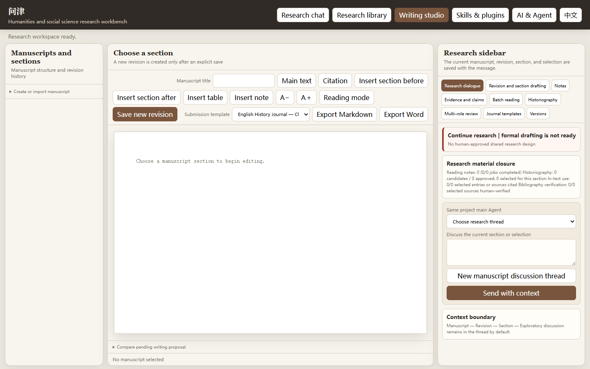
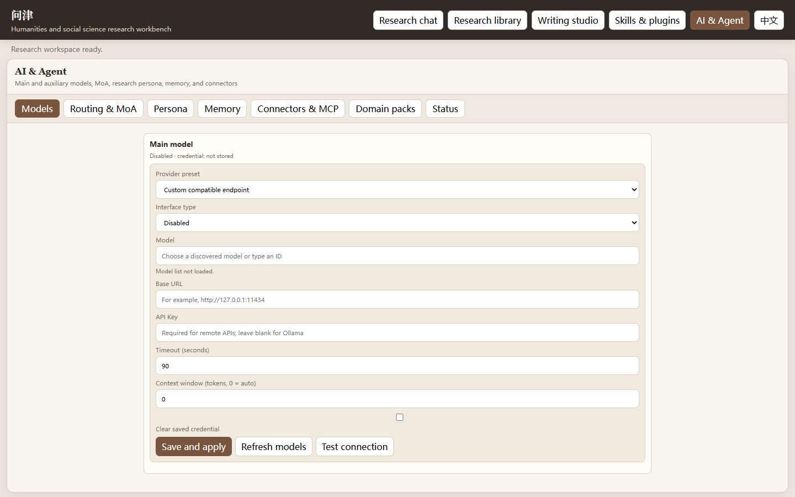

# Wenjin | Humanities and Social Science Research Workbench

English | [中文](README.md)

Wenjin is a local-first, model-selectable Agent workbench for humanities and social science research. It keeps research conversations, a personal library, source-page repair, bounded web research, evidence, historiography, drafting, Word round trips, Skills, CLI, and MCP on one auditable project data model.

The current release is **0.1.1 Public Preview** for Windows 10/11.





## Highlights

- Local projects with integrity-checked SQLite backups and non-destructive recovery.
- A research library that separates works, editions, files, and exact byte versions.
- Read-only folder inventory, suggested classification, and human-approved bulk registration.
- PDF page images, text blocks, cross-page relations, printed-page mapping, and human repair.
- Evidence, a source-linked event chronicle, and a two-layer knowledge graph for literature relations and Markdown-grounded content entities.
- Main and auxiliary models, Ollama, OpenAI-compatible APIs, and optional Mixture of Agents.
- Versioned research persona, Skills, MCP, CLI, and a two-way Codex bridge.
- Sixteen bundled Historical Research Skills plus an evidence-preserving Chinese historical-prose revision Skill.
- A structured writing studio with notes, references, DOCX import/export, and multi-role review.
- Chinese and English core navigation, model settings, and writing templates; layered project knowledge and optional local long-term-memory adapters.
- A neutral domain-pack SDK, local ZIP/folder installation, and user-owned local-data bindings.
- Experimental private research conversations through ordinary Weixin QR sign-in.

## Installation

Download `wenjin-0.1.1-x64-setup.exe` from the [v0.1.1 release](https://github.com/huanghaitck/wenjin/releases/tag/v0.1.1). It includes the components required to run Wenjin. End users do not need Python, Node.js, PowerShell 7, or Rust.

Most Windows 10/11 installations already include Microsoft Edge WebView2. For an offline machine, use `wenjin-0.1.1-win64-complete-20260821-1210.zip`, which also contains the WebView2 offline installer and `install-wenjin.cmd`.

The installer is not code-signed and Windows may display an unknown-publisher warning. Download it only from the project release page.

## Library inventory and registration

Inventory and registration are separate operations:

1. Select an explicit folder. Wenjin reads it without moving or editing files and proposes titles, authors, dates, material types, duplicate versions, and shelves.
2. Review selected candidates or use the suggested-classification bulk action.
3. Registration records the original path, bibliography, and exact file version. It does not rename, move, or rewrite the source file.
4. Suggested shelves remain editable.
5. Registration does not mean that a work has been read, is citable, or has become formal evidence.

The built-in shelves are Primary Sources, Articles, Monographs, Personal Papers and Drafts, Reference Works and Catalogs, and Unclassified.

## Agent access modes

Each research thread has one of three access modes:

- **Ask for approval** pauses before every computer state change.
- **Auto-approve routine research** permits routine reversible UI and organization actions but pauses before program launch, command execution, and other sensitive actions.
- **Full access** allows the current run to use exposed Computer Use, file, program, command, and domain-pack tools while retaining an audit trail.

Password controls, hidden credential extraction, CAPTCHA solving, and payment confirmation remain unavailable in every mode.

## Domain packs

Wenjin core is not tied to one discipline. In 0.1.1 a domain pack can add a specialist Skill, permission-bounded MCP tools, and local-data bindings. Schema, processor, graph-adapter, and panel entries may be declared for development, but they do not automatically change Wenjin screens yet.

The public repository contains a neutral scaffold rather than a preinstalled disciplinary sample or user dataset. Install a downloaded ZIP or folder from **AI & Agent > Domain packs**. If a pack declares a user-owned SQLite, CSV, or directory source, bind it after installation. Wenjin records an identity receipt and does not copy or rewrite that database.

Create a new scaffold with:

```powershell
wenjin plugin-create my-domain-plugin --output .\plugins
```

See the [Wenjin Domain Pack SDK](docs/WENJIN_PLUGIN_SDK.md).

## Development

Requirements: Python 3.13, Node.js, Rust stable, and PowerShell 7.

```powershell
conda env create -f environment.yml
conda activate historical-research-workbench
python -m unittest discover -s tests -v
node --check src/research_workbench/web_assets/app.js
npm ci
cargo check --locked --manifest-path src-tauri/Cargo.toml
```

Build the Windows installer:

```powershell
& .\scripts\build_desktop.ps1
```

The build script prefers `HRW_BUILD_PYTHON`, the active virtual environment, or a compatible Conda interpreter. An explicit interpreter may be supplied with `-PythonPath`.

## CLI and MCP

```powershell
wenjin --help
wenjin mcp-server C:\Research\my-project --library-root C:\Research\library
wenjin add-source C:\Research\my-project C:\Research\books\source.pdf
wenjin ingest-pdf C:\Research\my-project SOURCE_ID
wenjin serve C:\Research\my-project
```

The MCP server exposes qualified project status, source pages, library results, and manuscript structure. It does not bypass write approvals.

## Weixin connection

Open **AI & Agent > Connectors & MCP**, generate a QR code, and scan it with ordinary Weixin to try the experimental private-text connection. Approved private contacts can then continue the current local research conversation through Weixin. Sign-in information is kept in Windows secure credentials and is not written into the research project.

Version 0.1.1 supports replies to inbound private text only. Group chat, scheduled or proactive push, file transfer, payments, and CAPTCHA handling are not available. Tool calls still obey the selected Agent access mode; a paused action must be reviewed in the desktop application.

## Platform support

Version 0.1.1 is released for Windows 10/11 x64 only. A macOS binary is not yet available: computer control and secure-credential components currently use Windows interfaces and must be ported, built, and tested on macOS before a supported download can be published.

## Data, privacy, and credentials

- Projects, library records, backups, and memory adapters remain local by default.
- API keys and the Weixin bot token are stored in Windows Credential Manager, not project databases or source code.
- Remote models receive only selected page blocks, sections, or text ranges.
- Sign-in, CAPTCHA, paid access, and downloads from licensed databases remain under the researcher's lawful control.
- Private `historical-memory` and `codex-memory` vaults are not part of the public repository or release archives.

## Current limitations

- The installer is unsigned and there is no automatic update service.
- Complex DOCX fields, tracked changes, comments, and arbitrary embedded objects are not guaranteed to survive a round trip.
- Automatic bibliography recognition and shelf classification are proposals that require review.
- Authenticated databases are not accessed through unattended scraping or access-control bypass.
- Built-in journal templates must be checked against current venue requirements before submission.
- The Weixin gateway currently supports private text replies only and depends on an upstream protocol that may change.

## Documentation

- [English User Manual](docs/USER_MANUAL_EN.md)
- [中文使用手册](docs/USER_MANUAL_ZH.md)
- [Domain Pack SDK](docs/WENJIN_PLUGIN_SDK.md)
- [Third-party notices](THIRD_PARTY_NOTICES.md)

## License

Wenjin source code is licensed under [GNU Affero General Public License v3.0 only](LICENSE), SPDX `AGPL-3.0-only`. Third-party components and design references are listed in [THIRD_PARTY_NOTICES.md](THIRD_PARTY_NOTICES.md). A domain pack may carry separately licensed data under its own declarations.
