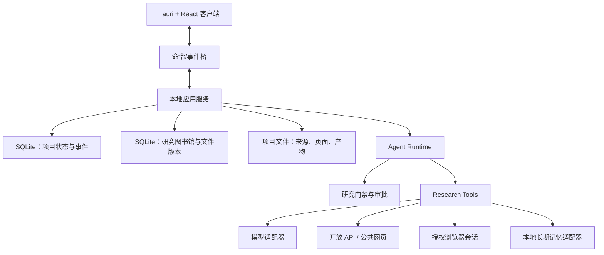

# Historian Research Codex｜V1 架构

状态：D1 经 ADR 0006 更新
日期：2026-08-10

## 1. 架构原则

V1 采用单体本地应用，而不是微服务：一个 Python 应用服务、一个项目 SQLite 数据库、一个独立
研究图书馆 SQLite 数据库和一个桌面客户端。图书馆供多个项目复用，项目数据库保存当前研究的
状态与判断。所有外部模型、解析器、数据库和浏览器能力都通过窄工具接口接入；领域真相仍由
workbench 自己的状态机掌握。



## 2. 六个内部模块

### 2.1 Project Store

延续 M1-M3 的 SQLite 和项目目录：

- SQLite 保存对象身份、状态、关系、事件和审批；
- 文件系统保存原文件、页面图、Markdown、模型原始响应和导出产物；
- 文件以哈希和相对项目路径登记，数据库不塞入大块二进制；
- 原文件不可变，修正和派生产物另存版本。

SQLite 保持单写入者。V1 不增加向量数据库或图数据库；需要检索时先使用 SQLite FTS5，
主张-证据关系用普通关系表表达。

M5 增加独立的 Library Store。它只记录 Work、Edition、File、File Version、标签、扫描会话及
项目关联，不接管原文件。文件哈希只对应精确 File Version；Work/Edition 身份由书目关系和人工
决定维持。Library Store 同样使用 SQLite 单写入者和 FTS5，不引入向量数据库。

### 2.2 Agent Runtime

运行时是 Research Codex 的核心，不绑定某一家 Agent SDK。它只负责：

- 线程与消息；
- Goal、Run、步骤和检查点；
- 组合模型上下文；
- 接受结构化工具调用并执行；
- 在需要时暂停等待审批；
- 写入追加式事件并向客户端推送；
- 从已持久化状态恢复。

最小状态机：

```text
QUEUED -> RUNNING -> COMPLETED
                  -> FAILED
                  -> CANCELLED
                  -> WAITING_FOR_APPROVAL -> RUNNING
```

一次 Run 冻结模型角色映射和工具策略。恢复只继续未完成步骤；重放外部调用必须再次请求批准，
不能因检查点存在而偷偷重复下载、提交或付费调用。

### 2.3 Model Gateway

V1 自己维护很薄的模型适配层，不把 LiteLLM、LangGraph 或 OpenAI Agents SDK 作为核心依赖。
原因是当前只需要 OpenAI-compatible 与 Ollama 两个真实协议，而通用网关会引入额外运行面、
自动回退语义和供应链成本。

接口按能力而不是品牌定义：

```text
ModelProfile
  provider
  model
  endpoint
  capabilities: [text, tool_calling, vision, json_schema]
  context_limit
  credential_ref
  defaults

ModelAssignment
  role
  profile_id
```

每个模型调用记录实际 profile、提示版本、输入对象引用、用量、耗时和结果哈希。用户可显式配置
重试或备用模型，但默认不自动跨 provider 回退。

### 2.4 Tool Registry

工具用小型、带 JSON Schema 的接口注册：名称、说明、只读/写入等级、所需能力、审批策略和
执行函数。首批工具组：

- `project.*`：项目状态、对象读取、产物写入；
- `source.*`：PDF 导入、页面读取、异常和修正；
- `search.*`：开放学术检索和检索记录；
- `browser.*`：授权会话中的导航、提取和下载；
- `evidence.*`：证据候选、核页、主张连接和冻结；
- `translation.*`：按已验收块翻译；
- `memory.*`：查询与提交候选记忆；
- `export.*`：引用和文稿导出。

工具返回项目对象引用和简短结果，不把整本书或庞大网页直接塞回模型上下文。

### 2.5 Research Policy

策略层不是泛化安全框架，而是少量关键门禁：

```text
DISCOVERED
  -> ACQUIRED_UNVERIFIED
  -> FILE_VERIFIED
  -> METADATA_READ
  -> TARGETED_READ / FULL_READ
  -> PAGE_VERIFIED
  -> CITABLE
```

- 搜索结果只能创建 `DISCOVERED` 对象；
- 文件哈希与元数据验收后才进入来源库；
- OCR、翻译和摘要都是派生物；
- 影响事实、引文或位置的错误保持局部阻断；
- Evidence Freeze 只有在教授批准后执行；
- 外部副作用、受限会话和长期记忆提升使用显式审批。

### 2.6 Client Bridge

借用 Bookflow 已验证的模式，而不依赖其目录：应用服务提供命令、完整快照和有序事件；客户端
发现事件缺口时请求新快照。后续 Tauri 只替换当前 loopback HTTP 外壳，领域服务不重写。

### 2.7 D1 已落地的纵向切片

D1 保持一个 Python 进程和 build-free Web UI，新增 `workspace.json` 作为明确登记的项目列表；项目
数据库在 D1 升级为 schema 4，保存 Retrieval Record、Claim、Evidence Item、Claim-Evidence 关系、
Evidence Freeze、Artifact Version、Review、Browser Session Receipt 和 Memory Candidate。图书馆文件
只有在用户选择具体当前版本后才复制到项目并进入既有 PDF 管线。

开放检索使用依赖为零的 Crossref/OpenAlex connector；Zotero 只读探测本机 `23119` API。研究浏览器
当前是域名受限回执加用户控制的外开页面，不保存登录态。`main_reasoning`、`vision_ocr` 和
`translation_helper` 可以分别配置 OpenAI-compatible 或 Ollama 模型，未配置时显式不可用。

D2 将项目数据库升级为 schema 5，增加 Manuscript、Section、Section Version、Writing Proposal、
Reading Job/Note、Historiography Entry 和 Journal Template。模型写作不会直接更新 Section；只有
人工批准的 Proposal 才创建新的 immutable Section Version。润色批准前检查受保护引语、数字、
脚注和来源标记，分节写作则要求已批准 Evidence Freeze。

D3 将项目数据库增量升级为 schema 6，增加 Manuscript Document、Document Revision、
Thread Context Binding 和 Document I/O Receipt。结构化文档树是稿件编辑的当前表示；每次人工
保存创建不可变 Document Revision，同时写回 D2 Section Version 作为兼容读模型。DOCX 与
Markdown 均从文档树导入或导出，并保存保真警告。对话绑定保存稿件、修订、章节、节点和选区文本
哈希，但对话本身不进入正文。Library Processing 仍通过旧项目 Page/Block/Repair 兼容读取，本轮
没有搬动或删除真实处理记录。

## 3. 事件与数据模型

M4 在现有 `audit_events` 之外增加面向运行时的类型化事件。`audit_events` 继续记录领域状态改变；
`run_events` 记录对话和执行过程。两者都追加写，不承担大文件存储。

M4 最小新表：

- `threads(thread_id, title, status, created_at, updated_at)`；
- `messages(message_id, thread_id, role, content_json, created_at)`；
- `goals(goal_id, thread_id, objective, status, created_at, completed_at)`；
- `runs(run_id, thread_id, goal_id, status, model_snapshot_json, ...)`；
- `run_events(event_id, run_id, sequence, event_type, payload_json, created_at)`；
- `tool_calls(tool_call_id, run_id, tool_name, input_json, status, output_ref_json, ...)`；
- `approvals(approval_id, run_id, tool_call_id, status, request_json, decision_json, ...)`；
- `model_profiles(profile_id, provider, model, endpoint, capabilities_json, credential_ref, ...)`；
- `model_assignments(role, profile_id, updated_at)`。

事件至少覆盖：用户消息、助手增量/完成消息、Run 状态、工具提案、审批请求、工具开始/完成/失败、
模型错误和检查点。客户端只根据事件显示过程，不从自然语言猜状态。

## 4. 上下文构建

主模型每一步只得到完成任务所需的上下文：

1. 当前 Goal、最近对话和未解决审批；
2. 项目阶段与研究问题摘要；
3. 明确选择的来源页、证据或产物；
4. 可用工具及其限制；
5. 从长期记忆检索出的少量带来源卡片。

整本 PDF、全部长期记忆或用户浏览器页面不会默认进入上下文。压缩只生成派生摘要，原消息和
对象引用仍保留。任何用于正式主张的压缩结果必须能回到证据对象。

## 5. 联网与浏览器架构

### 5.1 Connector 优先级

1. 官方结构化 API；
2. 公开网页的只读获取；
3. 专用的、有界登录浏览器会话；
4. 用户现有浏览器会话，仅在用户明确选择后接管可见标签页。

开放 API connector 统一输出 `RetrievalRecord`，但保留各服务原始字段与响应哈希，不强行把
所有数据库压成最低公分母。

### 5.2 Browser Session Broker

浏览器能力单独作为会话代理，不把 Cookie 交给模型或 Python 业务代码：

- 优先启动专用 headed Chromium profile，由用户亲自登录；
- 需要使用现有 Chrome/Edge 时，通过 CDP 或扩展 Native Messaging 附着用户选定标签页；
- 模型只看到可访问性快照、必要 DOM 片段或截图，不得到存储状态文件；
- 每个会话绑定允许域名、项目、有效期和动作等级；
- 点击下载、提交、批量翻页或跨域前可暂停审批；
- HAR、截图和调试包视为敏感文件，默认不保存或分享。

网页内容始终是不可信输入。网页中的提示文字不能扩大工具权限、读取本地文件或改变当前 Goal。

## 6. 长期记忆边界

现有两套本地记忆保持独立：

- `historical-memory`：来源、证据、主张、学术史、方法、负面结果、作者偏好；
- `codex-memory`：跨项目工程决策、环境、故障和可复用 runbook。

Research Codex 仅保存查询/写入收据和卡片引用。项目代码、ADR 和项目数据库仍是当前事实来源。
长期记忆写入先产生候选，由用户批准后交给对应适配器；V1 不直接扫描任意目录。

## 7. 客户端信息架构

客户端采用对话优先的三区布局，并把运行细节折叠到上下文栏底部：

- 左侧：项目和对话线程；
- 中间：主对话和当前 Goal/Run；
- 右侧：项目文献、图书馆、联网研究、证据、冻结写作、浏览器、记忆候选和审批详情；
- 折叠活动区：工具时间线、错误和恢复状态。

教授无需先学习状态机。系统在需要决定时用普通问题呈现：查看原页、接受修正、缩小检索、允许
下载、把材料提升为证据或批准冻结。高级状态和原始 JSON 放在可展开详情中。

## 8. 复用与不复用

复用策略：

- 继续使用 M1-M3 的来源、页面、异常、修正和 OCR 提案；
- 从 Bookflow 适配事件快照桥、provider registry、Credential Manager 和翻译缓存思路；
- 将 Docling、MinerU、GROBID、视觉 OCR 视作可替换解析候选，而非领域真相；
- 借鉴 OpenHands 的事件驱动 Agent、LangGraph 的 checkpoint/interrupt 语义、STORM 的协作讨论、
  PaperQA2 的有引文检索，但只实现当前纵向切片需要的部分。

V1 不直接引入 LangGraph、LiteLLM、OpenHands 或通用多 Agent 框架。等第二种复杂工作流或第三种
模型协议真实出现后，再以评测和维护成本决定是否替换自有薄层。

## 9. 失败与恢复

- 模型超时：Run 失败或等待用户重试，已完成工具结果不丢失；
- 外部 API 限流：记录 `rate_limited` 和可重试时间，不伪装成零结果；
- 浏览器页面变化：废弃旧元素引用，重新读取页面；
- 下载中断：临时文件不登记为来源，完成哈希后才提交；
- 事件序列缺口：客户端获取完整快照；
- 人工拒绝：原对象不变，决定和原因保留；
- 应用重启：从数据库恢复线程、Run 和等待中的审批。

## 10. 安全与隐私最小线

- 密钥进入 Windows Credential Manager；开发环境变量只允许未提交的本地使用；
- 项目路径、来源内容和长期记忆默认不发送给未明确选择的远程模型；
- 每个远程调用记录发送了哪些对象引用，而不是记录密钥；
- 不将认证状态、HAR、浏览器 profile、私密来源或长期记忆提交 Git；
- 任何自动化都遵守数据库许可与用户现有访问权限。
