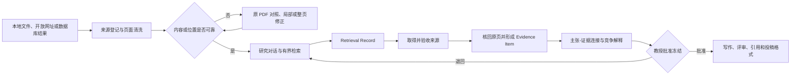

# Historian Research Codex｜产品与需求基线

状态：M4 前冻结基线  
日期：2026-08-09

## 1. 产品定义

Historical Research Workbench 的目标形态不是 PDF 阅读器、论文生成器或固定步骤的表单系统，
而是一个面向历史研究的、本地优先且可自选模型的 **Research Codex**。

它保留 Codex 类产品的核心体验：

- 以项目和长期对话线程组织工作；
- 接受开放式研究目标，而非要求用户先理解内部工作流；
- 由主 Agent 选择并调用明确工具；
- 显示任务、工具调用、等待人工、失败和恢复状态；
- 允许按角色选择本地或远程模型；
- 运行中断后可继续，关键产物可比较、追溯和撤回。

它与编程 Codex 的差异在 harness：历史研究中的来源、页码、版本、翻译、证据、论点和引用必须
经过显式状态门禁。模型可以提出建议、定位材料和形成候选，但不能把检索结果、OCR 文本或模型
判断静默升级为可引用证据。

## 2. 目标用户与核心工作

第一用户是已经有研究训练的历史学教师、博士生和青年研究者。系统首先帮助他们完成以下工作：

1. 把本地 PDF、图像、网页或数据库结果接入同一研究项目；
2. 把来源清洗为保留物理页、版面区域、阅读顺序和跨页关系的研究文本；
3. 围绕研究问题进行有界检索、资料取得、学术史梳理和补证；
4. 把材料固定为可以回到原页复核的证据，并连接到具体主张；
5. 与 Agent 进行有来源的学术讨论，保留异议、未决问题和教授的最终判断；
6. 由已批准的证据和论证生成或修改稿件、注释及期刊格式；
7. 在后续会话中恢复项目背景、已验证判断、失败检索和写作偏好。

系统不替教授决定研究问题、史料真伪、解释强度或学术价值。

## 3. 产品的核心对象

Research Codex 以项目为边界，但日常交互以对话线程为中心。PDF、检索记录、证据卡、论点图、
稿件和评审报告不是散落的功能页面，而是能被对话引用、打开和更新的项目对象。

最小对象集合：

- `Project`：研究项目和权限边界；
- `Thread` / `Message`：可长期恢复的研究对话；
- `Goal` / `Run`：用户目标及一次可暂停、恢复的执行；
- `Event` / `ToolCall` / `Approval`：模型与工具实际做过什么；
- `Source` / `SourceVersion` / `Page` / `Block`：原始材料与页面关系；
- `RetrievalRecord`：一次检索过程和结果，不等于证据；
- `EvidenceItem` / `ClaimLink`：经核页的证据及其可支持的主张；
- `ResearchDialogue`：有证据锚点的解释、反驳、未决问题和学者决定；
- `Artifact`：大纲、学术史、稿件、评审和导出文件；
- `MemoryReference`：指向外部长期记忆库的受控引用，不复制整个记忆库。

## 4. 端到端研究闭环

任何阶段均允许局部回退，但回退会生成新事件或新版本，不覆盖原记录。

## 5. 功能需求

### 5.1 Agent 工作空间

- 用户可创建、重命名、继续和归档研究线程；
- 一条线程可产生多个 Run，每个 Run 有明确目标、状态和模型配置快照；
- Run 支持完成、失败、取消、等待人工和恢复；
- 工具输入、输出摘要、错误、重试和人工决定均写入事件流；
- 对话可引用项目对象，点击后打开对应来源页或研究产物；
- 系统默认一个主 Agent；阅读、视觉、翻译、引文审计和评审是有界角色，不构成自由扩散的
  多 Agent 网络。

### 5.2 模型选择与角色搭档

用户按角色配置模型：

- `main_reasoning`：目标分解、研究对话和工具协调；
- `fast_reading`：大量已验收文本的低成本阅读；
- `vision_ocr`：扫描页、版面和疑难字符；
- `translation`：带原文锚点的翻译；
- `citation_audit`：引文、页码和书目信息核查；
- `review`：独立的论证或稿件评审。

首批提供 OpenAI-compatible 和 Ollama 连接方式。模型能力、上下文长度和是否支持视觉由配置
显式声明；缺少能力时显示不可用，不静默换模型。每次 Run 冻结实际 provider、model、参数和
提示版本。API 密钥不进入项目数据库、日志或 Git。

### 5.3 来源与 PDF

- 原文件只读复制并保存哈希；联网文件保存取得时间、原 URL、响应元数据和文件哈希；
- 文本输出必须保留物理页、印刷页候选、版面区域、块顺序和跨页关系；
- 解析器和视觉模型只产生候选；内容错误或位置关系不可靠的局部保持阻断；
- 人工可提交局部块或整页修正，必须看到原 PDF/页面图、候选文本和差异；
- 重要引文和事实只有在返回原页复核后才能进入 `CITABLE` 状态。

### 5.4 联网研究

联网入口分三类：

1. 开放 API 和公共网页；
2. 需要正式 API key、OAuth 或机构授权的服务；
3. 用户已经登录、但没有适用 API 的数据库网页。

所有检索先生成 `RetrievalRecord`，至少包括数据库、查询式、过滤条件、时间、结果标识、访问
状态和取得文件哈希。零结果和失败同样保留。搜索摘要、网页片段和目录记录只能用于发现，不能
直接成为证据。

优先接入 OpenAlex、Crossref、Semantic Scholar、Zotero、IIIF、Library of Congress、
Europeana 等正式接口。受限数据库只通过用户授权的可见浏览器会话操作；不提取 Cookie，不
收集密码，不绕过登录、验证码、付费墙或机构权限。下载、提交表单、批量操作和跨域跳转需要
可见审批。

### 5.5 证据、论证与学术讨论

- `EvidenceItem` 包含来源版本、物理页、区域/块、原文、必要译文、核验人、置信度和禁写边界；
- 一个证据可连接多个主张，但每条连接分别说明支持、削弱、背景或反证关系；
- 系统保存材料生成与传递关系、版本关系和来源独立性判断；
- Research Dialogue 中区分模型假设、来源事实、教授判断和仍未解决的问题；
- 证据冻结前执行竞争解释、反证、时间顺序和来源独立性检查；
- 冻结状态至少包括：可写、仅背景、反证、未决和禁止主张。

### 5.6 写作、引用与评审

- 只允许已冻结证据自动进入正式写作上下文；
- 稿件段落能反向定位所使用的主张和证据；
- 翻译保持原文块与译文块对齐，不替换原文；
- 支持期刊/学校引用样式配置、脚注审计、DOCX/Markdown/BibTeX/RIS 导出；
- 评审者默认只提交报告，唯一写作主体依据报告修改同一稿件；
- 支持保存审稿意见、作者答辩、修订决定和版本差异。

### 5.7 长期记忆

- 项目数据库保存当前任务状态；原始来源库保存文件；历史学长期记忆保存经审核的来源、证据、
  判断和写作偏好；工程记忆保存可复用的工具与故障经验；
- 通过适配器查询现有本地 Obsidian/SQLite 记忆，不把两套记忆复制到项目；
- 未核内容进入草稿/调查中状态，经用户批准后才可提升；
- 不写入密码、令牌、Cookie、受版权保护的整本全文或完整私密对话。

## 6. 非功能要求

- 本地优先；默认单机、单用户、一个应用服务和一个 SQLite 写入者；
- 原始材料不可覆盖，所有关键状态可审计和恢复；
- 提示注入或网页文本不能直接授权工具调用、读取其他项目或发送数据；
- 外部调用显示 provider、模型/服务、预计范围和结果状态；
- 失败不得伪装成空结果或成功产物；
- 不为未来需求预建微服务、分布式队列、图数据库或通用插件市场；
- 以真实史料页和真实研究任务持续做回归评测。

## 7. 第一可用版本的完成标准

第一可用版本不是“自动写完一篇论文”，而是以下纵向闭环可以在同一客户端完成：

1. 创建项目和对话线程，按角色选择模型；
2. 导入一个 PDF，查看页面 Markdown、原页和异常，人工修正局部或整页；
3. 在对话中要求进行一次有界开放检索，保留查询和结果记录；
4. 取得一个可访问文件或网页存档并登记为来源；
5. 从已验收页面创建证据卡，连接到一个主张；
6. 教授在学术讨论中批准、退回或标记未决；
7. 冻结一个小型证据包并生成一段带可回溯引文的试写；
8. 重启应用后恢复线程、Run、审批和所有对象关系。

这套闭环通过后，再扩展大规模阅读、完整学术史、长文写作、期刊模板和更多数据库。

## 8. 明确不做

- 不提供“一键生成可投稿论文”的虚假承诺；
- 不把向量召回、搜索排名或多模型一致意见当成史料核验；
- 不在用户不知情时使用登录态、发送文件、切换付费模型或扩大检索范围；
- 不绕过数据库许可和访问控制；
- 不把自由讨论中的全部内容自动写入长期记忆；
- 不让多个写作 Agent 并行拼接一篇正式论文。
